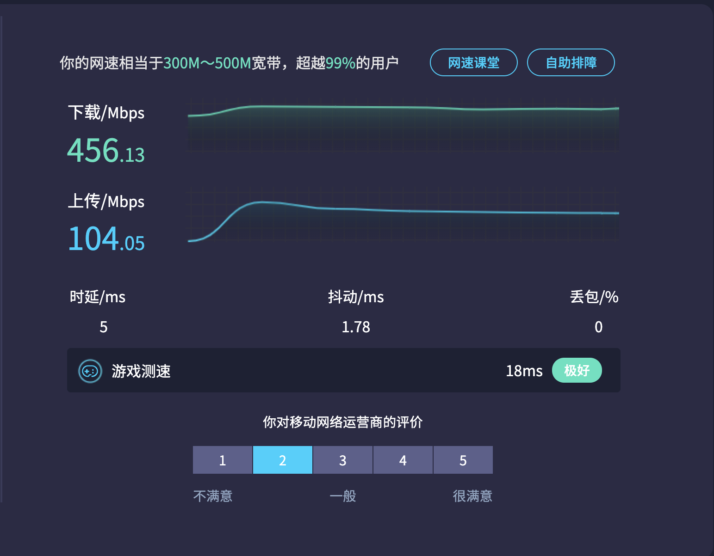
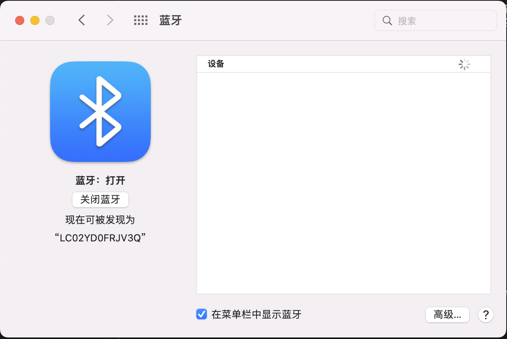

### 硬件信息
- nuc9i9qnx(理论上nuc9全系通用 包括幽灵峡谷 石英峡谷)
- 无线网卡: 板载intelax200网卡
- 内存: 英睿达 3200MHz 16GBx2 DDR4
- 显卡: 6600xt 免驱
- 硬盘: PREDATOR Gm7000 1000GB
- 声卡: 板载ALC256

### opencore
- opencore版本 0.8.1 
- 仿冒型号 iMac19,1

### 目前状态

目前来说大体可用，三码请自行添加

#### 已经完善

* [x] 板载的intel无线网卡，速度还不错

* [x] 核心显卡已经驱动但是用的目前的efi中仅作为计算使用，不能驱动输出
* [x] 独立显卡Readon 6600xt
* [x] USB接口已经定制，所有usb接口均可以使用
* [x] 声卡驱动正常
* [x] 休眠/唤醒正常
* [x] 蓝牙正常

#### 未完善
* [ ] 读卡器没有sd卡测试，但是这个读卡器走的是USB3.2的hub，理论上应该可以使用
* [ ] 雷电三载系统信息中能看到，但是手中没有硬件可以测试
* [ ] 有线网卡只有下面的口能用，上面的口插网线会崩溃

### 其他
- 暂时够我目前使用，应该还会继续完善。
- 如果不使用独立显卡，需要修改启动参数将 “agdpmod=pikera” 去掉，并修改核显缓冲帧为 07009B3E ，删除kexts中的RadeonSensor.kext 和 SMCRadeonGPU.kext 并在config.plist中同步删除
- 启动阶段会有一小段时间黑屏，但是不影响启动
