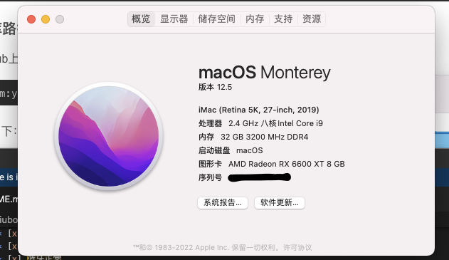
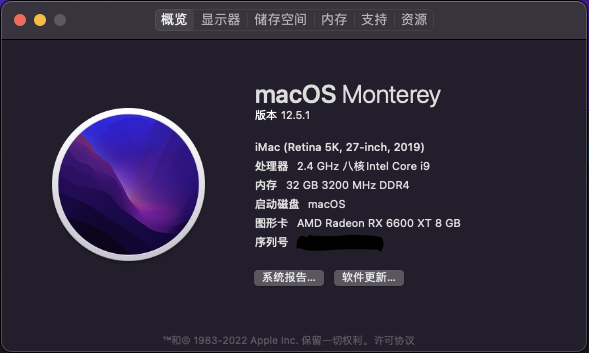
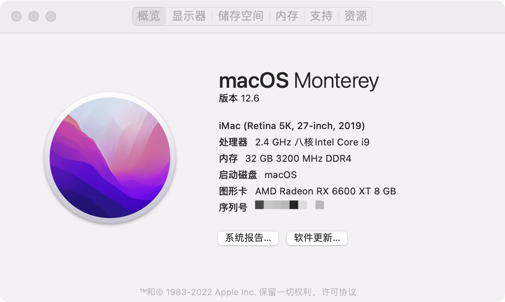
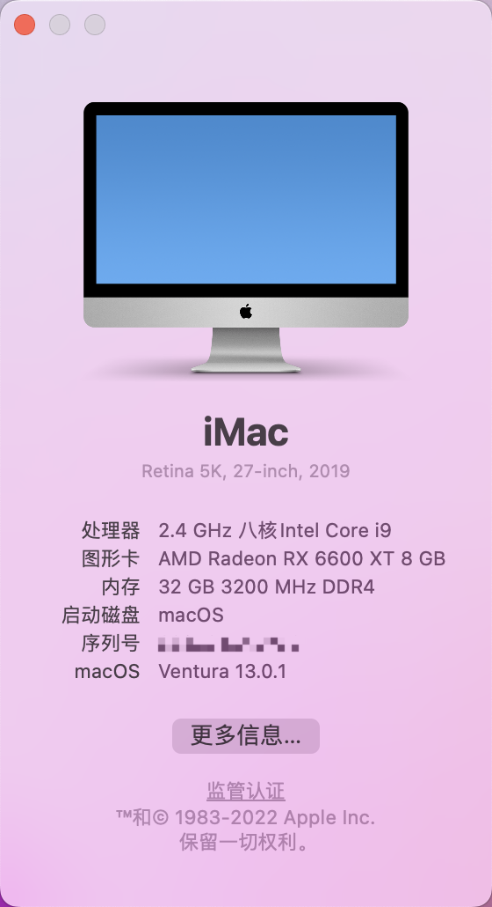

  ### 硬件信息
- nuc9i9qnx(理论上nuc9全系通用 包括幽灵峡谷 石英峡谷)
- 无线网卡: 板载intelax200网卡
- 内存: 英睿达 3200MHz 16GBx2 DDR4
- 显卡: 6600xt 免驱
- 硬盘: PREDATOR Gm7000 1000GB
- 声卡: 板载ALC256

	

### opencore
- opencore版本 0.8.5 
- 仿冒型号 iMac19,1

#### 已经完善

* [x] 板载的intel无线网卡，速度还不错

* [x] 核心显卡已经驱动但是用的目前的efi中仅作为计算使用，不能驱动输出
* [x] 独立显卡Readon 6600xt
* [x] USB接口已经定制，所有usb接口均可以使用（计算板上面有两个usb2.0的4pin接口 并未进行定制，如果更换白苹果网卡需要接此usb2.0接口的 需要自行定制对应的usb接口，或者使用 修订 目录下的  USBPort文件 由  [@MalsonQu](https://github.com/liu976336402/NUC9-hackintosh/commits?author=MalsonQu) 提供)

* [x] 声卡驱动正常
* [x] 休眠/唤醒正常
* [x] 蓝牙正常

* [x] 双网口驱动正常

#### 未完善
* [ ] 读卡器没有sd卡测试，但是这个读卡器走的是USB3.2的hub，理论上应该可以使用
* [ ] 雷电三载系统信息中能看到，但是手中没有硬件可以测试

### 其他
- 启动阶段会有一小段时间黑屏，但是不影响启动
- 关于更换白苹果网卡以后在Montery中蓝牙无法使用的问题 请移步国光大佬的博客 [国光的黑苹果安装教程](https://apple.sqlsec.com/) 
    - 自行定制usb [定制usb](https://apple.sqlsec.com/6-%E5%AE%9E%E7%94%A8%E5%A7%BF%E5%8A%BF/6-1/)
    - 更换kext文件 [macos12蓝牙](https://apple.sqlsec.com/6-%E5%AE%9E%E7%94%A8%E5%A7%BF%E5%8A%BF/6-7/) 
- NUC9可玩性很多 可以有不同的配置 具体配置请到pic目录中查看使用指南

### 更新记录
- 2022/7/29 升级至opencore0.8.2 系统无痛升级到Monterey 12.5

- 2022/8/26 升级至opencore0.8.3 系统无痛升级到Monterey 12.5.1

- 忘记哪一天了 无痛升级至Monterey 12.6

- 2022/10/25 升级至opencore0.8.5 
本次升级使用ocat工具升级 建议使用u盘放入新的efi并更换自己的三码后 使用u盘引导开机测试 成功后在替换磁盘efi分区中的efi文件
- 还是2022/10/25 系统无痛升级到Ventura 13.0  需要自行更换intel无线网卡的驱动 ，而intel无线网卡稳定版本kext并没有提供MacOS 13 下面的kext 所以使用了v2.0.2-alpha 版本的kext 也就是测试版，稳定性还需要自行测试 [这里是链接](https://github.com/OpenIntelWireless/itlwm/releases) 可自行下载

- 2022/11/13 升级至opencore0.8.6 系统全新安装升级到Ventura13.0.1

### 欢迎加入NUC9交流QQ群 群号 857594597

